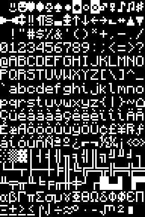

# TTYcraft
PC Screen Font (.psf) port of Monocraft

Available in 3 sizes:
- 6x9 (for low res monitors)
- 12x18 (for 1080p monitors)
- 18x27 (for 4k monitors)

# Credits
- [Monocraft](https://github.com/IdreesInc/Monocraft/tree/main) for inspiration
- [default8x16.psf](https://github.com/ercanersoy/PSF-Fonts/blob/master/default8x16.psf) font for unicode map and template
- [writepsf](https://github.com/talamus/solarize-12x29-psf/blob/master/writepsf) for bmp to psf conversion
